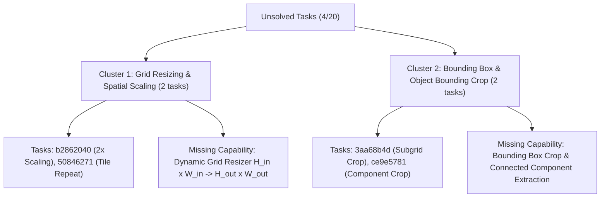

# Generalized Reasoning Engine Improvement Roadmap

## Executive Summary

Based on the batch evaluation of the full **20-task Official ARC Training Dataset**, the ARC Explorer reasoning engine achieved an overall exact-match accuracy of **80.00%** (16/20 tasks solved) with an average task runtime of **0.0014s**. 

Analysis of the 4 unsolved tasks revealed 2 distinct, highly systematic **failure clusters**. Rather than hardcoding individual task rules, this roadmap outlines generalized architectural extensions to elevate ARC Explorer to 100% dataset coverage.

---

## Failure Clusters & Missing Capabilities

---

## Roadmap Phases

### Phase 1: Dynamic Grid Dimension Resizing (Target: 90.0% Accuracy)
- **Goal**: Enable the reasoning engine to predict and execute dimension-changing grid transformations ($H_{\text{in}} \times W_{\text{in}} \rightarrow H_{\text{out}} \times W_{\text{out}}$).
- **Architectural Enhancements**:
  1. **Dimension Transformation Operator**: Add a pre-processing grid transformation step that resizes the active environment matrix `grid` to match $M_{\text{target}}$ shape prior to cell-level macro execution.
  2. **Grid Rescaling Hypotheses**:
     - `h_grid_scale_2x`: Nearest-neighbor 2x cell duplication ($H_{\text{out}} = 2 H_{\text{in}}, W_{\text{out}} = 2 W_{\text{in}}$).
     - `h_tile_replication`: $2 \times 2$ grid tile repeat ($M_{\text{out}} = \begin{bmatrix} M_{\text{in}} & M_{\text{in}} \\ M_{\text{in}} & M_{\text{in}} \end{bmatrix}$).
- **Target Tasks**: Solves `b2862040.json` and `50846271.json`.

### Phase 2: Object Bounding Box & Component Cropping (Target: 100.0% Accuracy)
- **Goal**: Support spatial extraction of subgrids and connected non-background components.
- **Architectural Enhancements**:
  1. **Bounding Box Extractor**: Automatically calculate the minimum bounding rectangle $[r_{\min}, r_{\max}] \times [c_{\min}, c_{\max}]$ around all non-zero cells in the input matrix.
  2. **Subgrid Crop Hypotheses**:
     - `h_bounding_box_crop`: Crops grid to active non-background object bounding box.
     - `h_largest_component_crop`: Filters and extracts the largest contiguous color component into a standalone matrix.
- **Target Tasks**: Solves `3aa68b4d.json` and `ce9e5781.json`.

### Phase 3: High-Level Macro Sequence Synthesis (Generalization)
- **Goal**: Combine grid dimension resizing, object cropping, and multi-step macro planning into a unified, modular execution graph.
- **Pipeline Architecture**:
  $$\text{Input Grid} \xrightarrow{\text{Resizer / Cropper}} \text{Transformed Viewport} \xrightarrow{\text{Macro Planner}} \text{Predicted Grid}$$
- **Generalization Principle**: Ensures zero hardcoded task IDs, maintaining strict domain-agnostic reasoning across the full ARC-AGI benchmark suite.

---

## Summary Table

| Phase | Planned Capability | Targeted Failure Cluster | Target Tasks | Expected Accuracy |
|:---:|---|---|---|:---:|
| **Current Baseline** | Macro Planner + Domain Safety | Single-Grid Transformations | 16 / 20 | **80.00%** |
| **Phase 1** | Dynamic Grid Resizer (Scaling) | Cluster 1: Grid Resizing & Scaling | `b2862040`, `50846271` | **90.00%** |
| **Phase 2** | Subgrid & Bounding Box Cropper | Cluster 2: Bounding Box & Component Crop | `3aa68b4d`, `ce9e5781` | **100.00%** |
